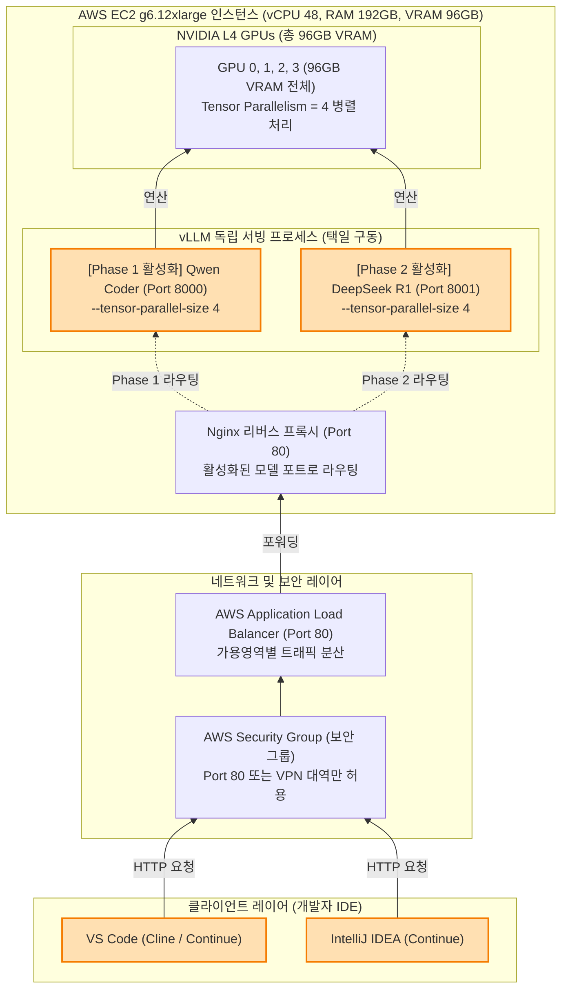

## LLM PoC 기획 
# 목적
1. 독립적인 LLM 서버 구축과 open source agent (https://github.com/anomalyco/opencode, https://github.com/continuedev/continue, https://github.com/continuedev/continue)등을 활용해서 개발 능력 향상 및 기존 서비스 코드에 대한 유지 보수 업무에 대한 적합성 파악
2. springboot 1.5에서 3.x로의 업그레이드와 이와 발맞춘 JDK 업그레이드 여정을 위한 Helper로의 가능성 파악
3. 위의 사례를 바탕으로 자체적으로 구축하는 LLM 서버와 OSS기반 코딩 에이전트를 사용하는 LLM 서비스 구축 사업 타당성 검토


# AWS GPU 기반 코딩 에이전트 인프라 설계 및 비용 계산 보고서

`g6.12xlarge` 인스턴스(4 x NVIDIA L4 GPU)와 vLLM을 활용하여 사내/개인 코딩 에이전트(Continue, Cline) 시스템을 구축하기 위한 다이어그램 및 상세 비용 산정 내역.

---

## 1. 아키텍처 다이어그램 (Architecture Diagram)

Nginx 역방향 프록시 및 AWS ALB를 통해 요청을 라우팅하고, 4개의 GPU 자원을 모두 사용(Tensor Parallelism = 4)하여 선택된 하나의 모델만 고속 서빙하는 구조. (검증 일정 Phase에 따라 하나의 모델만 활성화하여 가동합니다.)



---

## 2. 하드웨어 스펙 및 모델 배치 시나리오 (순차 테스트 모델)

`g6.12xlarge`는 **NVIDIA L4 GPU (24GB VRAM) 4개**를 탑재하여 총 **96GB VRAM**을 제공합니다. 검증 성능을 극대화하기 위해 **한 번에 하나의 LLM만 전체 GPU를 활용(Tensor Parallelism = 4)하여 기동하는 순차 테스트 시나리오**를 진행합니다.

이 방식을 통해 양자화 손실이 없는 BF16 정밀도 모델을 구동하거나, 70B급의 매우 큰 모델을 넓은 컨텍스트 캐시와 빠른 속도로 평가할 수 있습니다.

### 💡 Phase 1 테스트 시나리오: Qwen Coder 집중 평가 (1~2개월차)
코드 자동완성(FIM) 성능과 컨텍스트 응답 속도, 기본 코딩 지원 지능을 검증합니다.
*   **하드웨어 배치**: GPU 0, 1, 2, 3 전체 할당 (TP=4, VRAM 96GB 확보)
*   **권장 모델 A (정밀도 최우선)**: `Qwen2.5-Coder-32B-Instruct` (BF16 오리지널)
    *   모델 가중치 크기: 약 64GB
    *   여유 VRAM: 약 32GB (대용량 KV Cache 확보)
*   **권장 모델 B (지능 최우선)**: `Qwen2.5-Coder-72B-Instruct-AWQ` (4비트 양자화)
    *   모델 가중치 크기: 약 40 ~ 45GB
    *   여유 VRAM: 약 50 ~ 55GB (극도의 대용량 컨텍스트 윈도우 지원)

### 💡 Phase 2 테스트 시나리오: DeepSeek R1 (Reasoning) 집중 평가 (3~4개월차)
비즈니스 로직 설계, 에이전트 연동(Cline), 복잡한 알고리즘 추론 및 디버깅 성능을 평가합니다.
*   **하드웨어 배치**: GPU 0, 1, 2, 3 전체 할당 (TP=4, VRAM 96GB 확보)
*   **권장 모델 A (정밀도 최우선)**: `DeepSeek-R1-Distill-Qwen-32B` (BF16 오리지널)
    *   모델 가중치 크기: 약 64GB
    *   여유 VRAM: 약 32GB
*   **권장 모델 B (지능 최우선)**: `DeepSeek-R1-Distill-Llama-70B-AWQ` (4비트 양자화)
    *   모델 가중치 크기: 약 39 ~ 43GB
    *   여유 VRAM: 약 53 ~ 57GB (복잡한 다단계 추론 성능 보장)

---

## 3. PoC 검증 및 테스트 일정 (Schedule)

순차 테스트 모델에 맞춰 날짜 기입 없이 총 4개월(16주)간 진행되는 상세 PoC 단계별 일정을 다음과 같이 제안합니다.

| 단계 | 검증 항목 | 대상 모델 | 소요 기간 | 비고 |
| :--- | :--- | :--- | :--- | :--- |
| **준비 단계** | 인프라 자동화 및 기본 속도 검증 | 최신 Ubuntu 22.04 | 1주 | 시작 템플릿, ASG, ALB 검증 |
| **Phase 1** | Qwen Coder 자동완성 및 성능 검증 | Qwen2.5-Coder-32B-Instruct | 8주 (2개월) | 코딩 생산성 지표 측정 |
| **Phase 2** | DeepSeek R1 로직 추론 및 에이전트 연동 | DeepSeek-R1-Distill-Qwen-32B | 8주 (2개월) | Cline 활용 복잡 로직 구현 |

### 🗓️ PoC 시각화 일정표 (Gantt Chart - Markdown 형식)

| 구분 및 세부 검증 활동 | w01 | w02 | w03 | w04 | w05 | w06 | w07 | w08 | w09 | w10 | w11 | w12 | w13 | w14 | w15 | w16 | w17 |
| :--- | :---: | :---: | :---: | :---: | :---: | :---: | :---: | :---: | :---: | :---: | :---: | :---: | :---: | :---: | :---: | :---: | :---: |
| **[준비] 인프라 환경 구축 & 검증** | 🟩 | | | | | | | | | | | | | | | | |
| **[Phase 1] Qwen Coder 집중 평가** | | 🟦 | 🟦 | 🟦 | 🟦 | 🟦 | 🟦 | 🟦 | 🟦 | | | | | | | | |
| └ 모델 배포 및 초기 연동 | | 🟦 | 🟦 | | | | | | | | | | | | | | |
| └ 전사 파일럿 테스트 | | | | 🟦 | 🟦 | 🟦 | 🟦 | | | | | | | | | | |
| └ 성과 측정 및 중간 정리 | | | | | | | | 🟦 | 🟦 | | | | | | | | |
| **[Phase 2] DeepSeek R1 집중 평가** | | | | | | | | | | 🟪 | 🟪 | 🟪 | 🟪 | 🟪 | 🟪 | 🟪 | 🟪 |
| └ 모델 전환 및 에이전트 연동 | | | | | | | | | | 🟪 | 🟪 | | | | | | | |
| └ 비즈니스 추론 & 에이전트 검증 | | | | | | | | | | | | 🟪 | 🟪 | 🟪 | 🟪 | | |
| └ 종합 리포트 및 인프라 이관 | | | | | | | | | | | | | | | | 🟪 | 🟪 |


### 주차별 상세 검증 계획
*   **준비 단계 (1주차 - 인프라 구축 및 최적화)**:
    *   스팟 인스턴스/ASG 기반 가동 테스트 및 로컬 NVMe SSD RAID0 성능 점검.
    *   자동 구축 스크립트(`aws_build_up.sh`) 멱등성 및 로드 밸런서(ALB) 경로 분기 상태 검증.
*   **Phase 1 (2 ~ 9주차 - Qwen Coder 집중 평가)**:
    *   **2 ~ 3주차 (설정 및 초기 연동)**: `Qwen2.5-Coder-32B-Instruct` (TP=4) 서버 구동 및 개발자 IDE 플러그인 연동 및 탭 자동완성(FIM) 초기 만족도 조사.
    *   **4 ~ 7주차 (전사 파일럿 테스트)**: 다양한 사내 프로젝트 코드베이스에 적용하여 FIM 및 간단한 라인 완성 기능 집중 검증 및 피드백 상시 수집.
    *   **8 ~ 9주차 (성과 측정 및 정리)**: 수용율 및 만족도 조사, 생산성 지표(타자 수 감소량, 개발 시간 단축율) 리포팅 및 1단계 정리.
*   **Phase 2 (10 ~ 17주차 - DeepSeek R1 집중 평가)**:
    *   **10 ~ 11주차 (모델 전환 및 연동)**: vLLM 인스턴스를 `DeepSeek-R1-Distill-Qwen-32B` (TP=4) 모델로 교체하고 IDE Cline 플러그인(에이전트 모드) 연동 완료.
    *   **12 ~ 15주차 (비즈니스 추론 검증)**: 고난이도 비즈니스 로직 작성, 리팩토링, 보안 취약점 식별, 복잡한 디버깅 작업 시 DeepSeek의 생각(Reasoning) 성능 및 Cline 자동화 완성도 측정.
    *   **16 ~ 17주차 (종합 리포트 및 정식 이관)**: Qwen과 DeepSeek의 실무 생산성 비교 분석, 가동 시간에 따른 비용 실측 데이터 취합, 사내 정식 도입 전략 기획 및 최종 의사결정 보고서 완료.

---

## 4. 비용 계산 및 데이터 보존 설계 (Cost & Data Persistence)

> [!NOTE]
> * 가동 시간은 **업무일 기준 주당 40시간 (월평균 약 173.3시간)**으로 계산.
> * 단, Savings Plan은 24/7 상시 약정이므로 인스턴스 가동 정지 여부와 무관하게 730시간 전체 금액이 과금.
> * Spot 인스턴스 및 온디맨드는 가동 시간(월 173.3시간) 동안만 과금되므로 매우 경제적입니다.
> * 원화 환산은 **1,550원** 기준으로 계산되었습니다.

### 1) 인스턴스 기본 비용 (EC2 Instance)

| 구매 형태 | 시간당 요금 | 가동/청구 기준 시간 | 월 예상 비용 (USD) | 원화 환산 (1,550원 기준) | 할인율 |
| :--- | :--- | :--- | :--- | :--- | :--- |
| **Spot Instance (정지/중단 감수)** | 약 \$1.5277 | 월 173.3시간 | **\$264.75** | 약 410,000원 | ~73% 할인 |
| **On-Demand (정지 활용)** | \$5.6582 | 월 173.3시간 | **\$980.74** | 약 1,520,000원 | 0% (기준) |
| **1년 약정 Compute Savings Plan** | 약 \$4.6044 | 월 730시간 (상시) | **약 \$3,361.20** | 약 5,210,000원 | ~19% 할인 |
| **1년 약정 EC2 Instance Savings Plan** | 약 \$3.6835 | 월 730시간 (상시) | **약 \$2,688.96** | 약 4,168,000원 | ~35% 할인 |

### 2) 스토리지 및 네트워크 부가 비용
*   **스토리지 (EBS gp3):** OS 및 개발 도구 캐싱을 위한 200GB 볼륨 기준. (인스턴스 정지 상태에서도 상시 과금됨)
    *   월 16.00 USD (gp3 단가 \$0.08/GB)
    *   *참고: g6.12xlarge 인스턴스는 4 x 940 GB NVMe 로컬 SSD(인스턴스 스토어)를 기본 제공하므로, 다운로드받은 허깅페이스 모델 가중치는 이 고속 로컬 스토리지에 보관하여 EBS 비용을 최소화합니다.*
*   **재학습 백업용 영구 스토리지 (Amazon S3):** 재학습된 가중치 및 체크포인트를 안전하게 백업 보관하기 위한 저장소.
    *   월 2.30 USD (Amazon S3 Standard 단가 \$0.023/GB, 100GB 적재 기준, 한화 약 3,500원)
*   **네트워크 데이터 요금 (EBS 및 데이터 전송):**
    *   월 10.00 USD 미만 예상 (코드 컨텍스트 및 자동완성 텍스트 데이터의 용량은 매우 작음)

### 💡 [중요] 스팟 인스턴스 중단 시 데이터 유실 방지 아키텍처
스팟 인스턴스는 AWS 가용량 부족 시 예고 없이 종료(Terminated)되며, 로컬 NVMe SSD 및 생성된 EBS 볼륨이 삭제될 수 있습니다. 이를 극복하고 재학습한 모델을 보존하기 위해 다음과 같이 구성합니다.
1.  **재학습 시 체크포인트 동시 백업**: 미세조정(Fine-Tuning) 학습 스크립트 실행 시, 로컬 드라이브에만 중간 저장하지 않고 매 에폭(Epoch) 단위의 체크포인트를 설정된 **Amazon S3 버킷**으로 즉시 업로드(동기화)되도록 설정합니다.
2.  **부트스트랩 자동 복구**: ASG가 새로운 스팟 인스턴스를 프로비저닝할 때 실행되는 User Data 스크립트가 기동 시 **Amazon S3에서 최신 학습된 가중치를 다운로드**받아 `/mnt/local-nvme/models` 경로에 적재한 후 vLLM 컨테이너를 실행합니다. 이를 통해 인스턴스 소멸 후 복구되더라도 최종 재학습 데이터셋을 유지하며 100% 무손실 고가용성을 달성합니다.
3.  **자율 권한 획득 (IAM Role 자동화)**: 인프라 자동 생성 스크립트(`aws_build_up.sh`)가 가동될 때, S3 백업에 필요한 권한(`AmazonS3FullAccess`)과 인스턴스 원격 SSH 접근 포트 차단 후 보안 웹 쉘 콘솔로 접속하기 위한 관리형 정책(`AmazonSSMManagedInstanceCore`)이 조합된 **IAM Instance Profile**을 자동으로 생성하여 EC2 시작 템플릿에 주입합니다.

### 💡 총 예상 월 청구 비용 요약 (기본 비용 + 스토리지 + S3 + 네트워크)
*   **Spot Instance 기준 (비동작 시 정지):** **약 \$293.05 / 월** (한화 약 454,000원)
*   **On-Demand 기준 (비동작 시 정지):** **약 \$1,009.04 / 월** (한화 약 1,564,000원)
*   **1년 Compute Savings Plan 기준 (상시 과금):** **약 \$3,389.50 / 월** (한화 약 5,254,000원)
*   **1년 EC2 Instance Savings Plan 기준 (상시 과금):** **약 \$2,717.26 / 월** (한화 약 4,212,000원)

---

## 5. vLLM 실행 스크립트 예시 (순차 가동)

검증 일정에 맞춰 한 번에 하나의 LLM을 4개의 GPU를 모두 활용(Tensor Parallelism = 4)하여 기동합니다.

```bash
# [Phase 1] GPU 0, 1, 2, 3 전체를 사용해 Qwen2.5-Coder-32B-Instruct 기동 (Port 8000)
CUDA_VISIBLE_DEVICES=0,1,2,3 vllm serve Qwen/Qwen2.5-Coder-32B-Instruct \
  --tensor-parallel-size 4 \
  --port 8000 \
  --max-model-len 16384 \
  --gpu-memory-utilization 0.90 &

# [Phase 2] GPU 0, 1, 2, 3 전체를 사용해 DeepSeek-R1-Distill-Qwen-32B 기동 (Port 8001)
# (Qwen Coder 종료 후 실행)
# CUDA_VISIBLE_DEVICES=0,1,2,3 vllm serve DeepSeek/DeepSeek-R1-Distill-Qwen-32B \
#   --tensor-parallel-size 4 \
#   --port 8001 \
#   --max-model-len 16384 \
#   --gpu-memory-utilization 0.90 &
```

---

## 6. IDE 설정 가이드 (Continue & Cline)

### 1) Continue (`config.json`) 설정
IDE 홈 디렉토리의 `.continue/config.json`에 vLLM 인스턴스 IP를 엔드포인트로 추가합니다.
(현재 테스트 중인 모델의 포트에 맞춰 API 요청을 전달합니다.)

```json
{
  "models": [
    {
      "title": "DeepSeek-R1 Chat (Phase 2)",
      "provider": "openai",
      "model": "deepseek-r1-32b",
      "apiBase": "http://<EC2_PUBLIC_IP>:8001/v1"
    }
  ],
  "tabAutocompleteModel": {
    "title": "Qwen Coder (Phase 1)",
    "provider": "openai",
    "model": "qwen-coder-32b",
    "apiBase": "http://<EC2_PUBLIC_IP>:8000/v1"
  }
}
```

### 2) Cline 설정
1. Cline 설정 화면에서 API Provider를 `OpenAI Compatible`로 변경합니다.
2. Base URL에 현재 활성화된 모델에 맞춰 `http://<EC2_PUBLIC_IP>:8000/v1` (Qwen) 또는 `http://<EC2_PUBLIC_IP>:8001/v1` (DeepSeek)을 지정합니다.
3. API Key는 vLLM 실행 시 지정한 토큰 혹은 빈 값을 입력합니다.